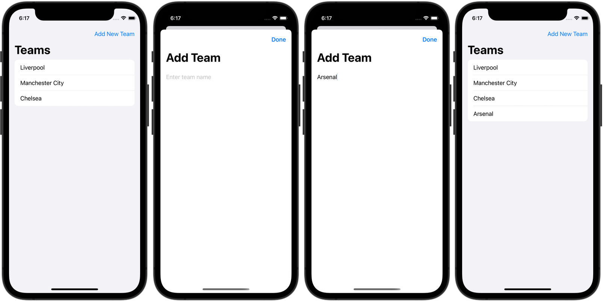
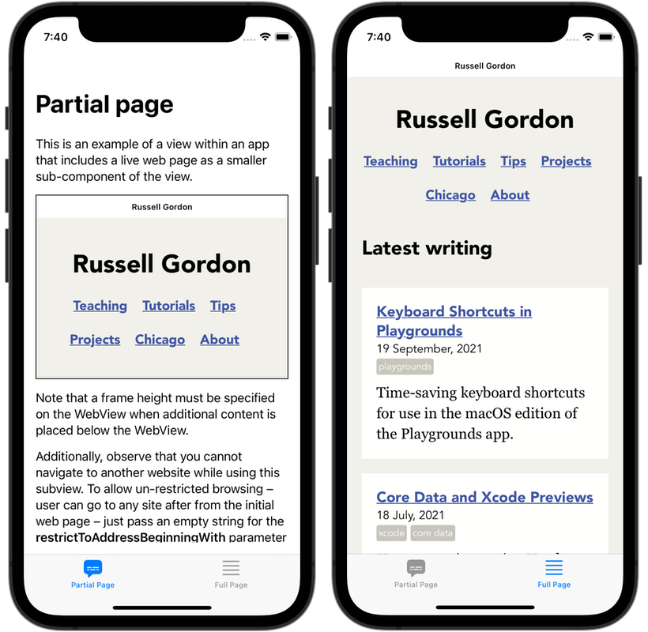
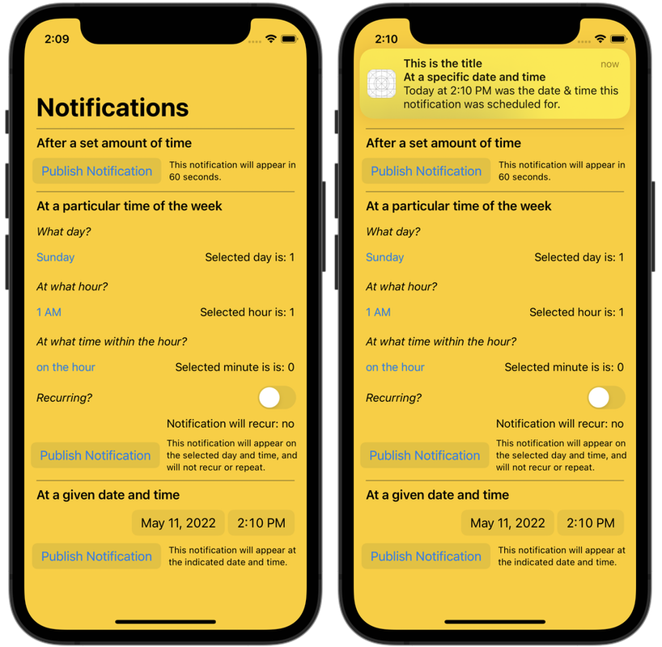
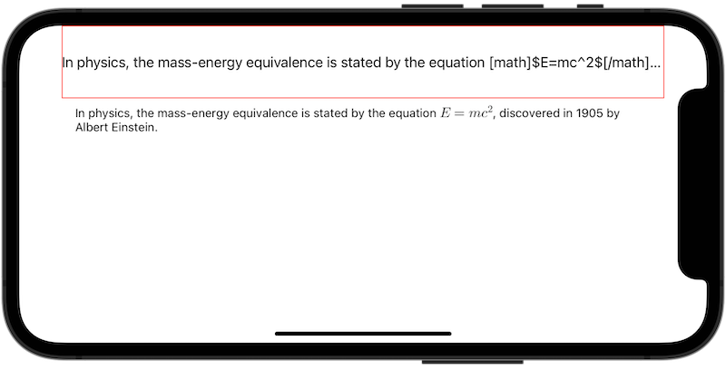
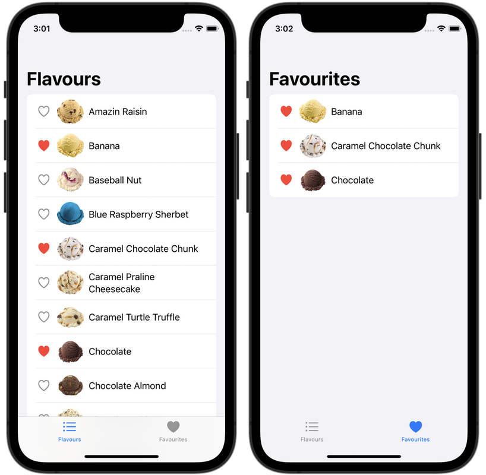

# Culminating Task Code Snippets

This is a workspace to share small code examples, or *snippets*, that various students need to complete their culminating task.

These code snippets represent either:

* a technique that goes beyond reasonable expectations for a student in a Grade 11 course
* a simpler technique that while useful, was not previously shared this year
* a shorter recap of a technique we have seen earlier this year

## Sheets

A *sheet* is a view that slides up from the bottom of the device when activated. Sheets are often used to present an interface where the user can add new information that is later showed in other parts of the app.

The only concept that is truly new here is the `.sheet` modifier.

In short, a [source of truth that is a `Bool`](x-source-tag://se_boolean) exists on the main teams list page. This boolean, `isAddTeamShowing`, controls whether the sheet is presented, and begins holding a value of `false`.

When the `Add New Team` button is pressed, the `isAddTeamShowing` boolean is changed to `true`.

The `.sheet` modifier watches the boolean, and when it becomes `true`, it "slides up" and presents the `AddTeamView` interface.

The `AddTeamView` button receives a derived value of `isAddTeamShowing` from the source of truth on `TeamListView`, using the `@Binding` property wrapper.

Within [`AddTeamView`](x-source-tag://se_addteamview) the user can provide a new team name. When they tap the `Done` button, the new team is saved in the `teams` list and the `isAddTeamShowing` boolean is changed back to `false`.

Since `isAddTeamShowing` on `AddTeamView` is connected to the source of truth on `TeamListView`, the `.sheet` modifier sees that `isAddTeamShowing` is now false again, and the sheet disappears.

If you wish to learn more, it may be helpful to see how this example app was built, step by step:

1. First, a [static view for the teams list](https://github.com/lcs-rgordon/SheetsExample/commit/629c8253d64bc32217a3b19926e6df77de21e504#diff-02f986b1c76eb549514d911dc6a6914c6d78057ca9594e03dbb13bcbd359b047) was created.
2. Next, a [static view for the interface to add a team](https://github.com/lcs-rgordon/SheetsExample/commit/7719f8ee5ab8a022cb9970af698298642a833aed#diff-3bfb793feba4b2a9d64833848db680bc1b6e694b87b9f413b0a5723c119bce40) was created.
3. Then, we [create the source of truth, `isAddTeamShowing`, on the teams list view](https://github.com/lcs-rgordon/SheetsExample/commit/de9590178027fdbbb3de1a160a935ff981a5e41d#diff-02f986b1c76eb549514d911dc6a6914c6d78057ca9594e03dbb13bcbd359b047), which controls whether the sheet appears. The boolean's value is received using `@Binding` [on the view which allows a team to be added](https://github.com/lcs-rgordon/SheetsExample/commit/de9590178027fdbbb3de1a160a935ff981a5e41d#diff-3bfb793feba4b2a9d64833848db680bc1b6e694b87b9f413b0a5723c119bce40). *It is in this commit where the use of the `.sheet` view modifier is most clearly shown.*
4. For completeness, in the final commit, how to make this example app work with "live data" is shown. A [data structure to describe a team](https://github.com/lcs-rgordon/SheetsExample/commit/5e82730c082827e4512bee70ebbb4d0a3dccbd1f#diff-6c537c566d131afb5d74cee22cb0328e9c9aed9f7fe5eda35186c58ae7bfd75b) is created, a [source of truth for the list of teams](https://github.com/lcs-rgordon/SheetsExample/commit/5e82730c082827e4512bee70ebbb4d0a3dccbd1f#diff-aa38b26f41604fc7bda497a8d224bd56870b65880287d77ac78273a386dd2680) is made at the app entry point, that list is [shared with the main teams list interface](https://github.com/lcs-rgordon/SheetsExample/commit/5e82730c082827e4512bee70ebbb4d0a3dccbd1f#diff-02f986b1c76eb549514d911dc6a6914c6d78057ca9594e03dbb13bcbd359b047), and finally, the list is passed on once again to the [view that allows a new team to be added to the list](https://github.com/lcs-rgordon/SheetsExample/commit/5e82730c082827e4512bee70ebbb4d0a3dccbd1f#diff-3bfb793feba4b2a9d64833848db680bc1b6e694b87b9f413b0a5723c119bce40).   

## Web View

Several students have made plans to show live web pages within their app. This, as opposed to simply using the [`Link` structure in SwiftUI](https://developer.apple.com/documentation/swiftui/link), which simply bumps the user over to the mobile Safari app to view the website.

See:

* [`PartialPageExampleView`](x-source-tag://wv_partial_page)
    * ... for an example of how to load a web view as just a smaller part an existing view
* [`FullPageExampleView`](x-source-tag://wv_full_page)
    * ... for an example of how to load a web view so that it takes up the entire screen
    
To use this within your own app, copy the contents of these groups into your own Xcode project:

* `Model`
    * `WebViewModel.swift`
* `Views`
    * `Helpers`
        * `WebViewContainer.swift`
        * `WebView.swift`

It is recommended that if these groups do not currently exist within your project, that you create them before copying these files over to your project.

## Notifications

It is useful for an app to be able to reach a user when they may not be using that app. Notifications allow for this. This example delivers notifications whether the app is running in the foreground, or not. 

Notifications can be [scheduled for delivery after a time interval](x-source-tag://notifications_time_interval) (specified in seconds), at a [certain date and time during a week](x-source-tag://notifications_date_time) – with the ability to mark the notification as recurring, or for any [single future date and time](x-source-tag://notifications_single_date_time). 

See:

* [`ContentView`](x-source-tag://notifications_publish_notification)
    * ... and calls to the `publishNotification` functions for examples of how to schedule a notification.
    
To use this within your own app, first copy the contents of these groups into your own Xcode project:

* `Delegates`
    * `AppDelegate.swift`
* `Helpers`
    * `SharedConstants.swift`
    * `SharedFunctions.swift`
    
It is recommended that if these groups do not currently exist within your project, that you create them before copying these files over to your project.

As well, note that you must add this line of code:

`@UIApplicationDelegateAdaptor(AppDelegate.self) var appDelegate`

... to your [app entry point](x-source-tag://notifications_delegate_adaptor), which in this example, is `LocationNotificationsExampleApp`. This is necessary so that your app can receive notifications even while it is running in the foreground.

## Symbolic Math 

SwiftUI by default does not support the rendering of symbolic math.

However, for certain types of apps, rendering symbolic math is crucial.

The [`RichTextView` third party framework](https://richtextview.com/docs/overview) makes it possible to render symbolic math easily in a SwiftUI project.

Unfortunately, installing and configuring that framework for use within a project is non-trivial.

Mr. Gordon has therefore created an Xcode workspace with `RichTextView` already configured and ready to use.

However, `RichTextView` requires the use of an Xcode workspace – so it is not possible to embed within this project directly (since it is already it's own Xcode workspace).

Therefore, the best way to make use of symbolic math in your app is simply to [fork and clone](https://www.russellgordon.ca/cs/source-control/how-to-fork-and-clone-a-repository/) the [`LatexMathExample` repository](https://github.com/lcs-rgordon/LatexMathExample).

Then, use the code within the `LatexMathExample` workspace as the starting point for your own project.  

Finally, you may be wondering – what the heck is *LaTeX* (pronounced *lay*-teck) – and what does it have to do with symbolic math?

The answer is that LaTeX is a well-established "document preparation system for high-quality typesetting".

If you someday write an academic paper of any kind related to science, technology, engineering, or medicine – it is highly likely you will be using LaTeX to typeset your symbolic math.

So, if you want to show equations within your app, you need to learn LaTeX – fortunately, [there are examples available](https://support.apple.com/en-us/HT202501#sample) and it is not too hard to learn the basics. For what it's worth, Apple's office productivity apps – [Pages](https://apps.apple.com/us/app/pages/id409201541?mt=12) (word processor), [Numbers](https://apps.apple.com/ca/app/numbers/id409203825?mt=12) (spreadsheets), and [Keynote](https://apps.apple.com/us/app/keynote/id409183694?mt=12) (presentations) – which are likely pre-installed on your Mac, [also allow you to write equations using LaTeX](https://support.apple.com/en-us/HT202501).

## Favourites 

How a programmer chooses to handle keeping track of favourite items will vary based on the way their app is organized.

Favourites could be tracked using two lists. This is what the SongBrowser app does. One list is used to store search results obtained from the remote endpoint, and a second list is used to store favourites; you can [review that code here](https://github.com/lcs-rgordon/SongBrowser/blob/027557959bde8da3720d4fc8cfd054268cdc73dc/SongBrowser/Views/SearchView.swift#L17-L22).

Favourites could also be tracked using a single list. Items in the list have a property that controls whether the item is seen as a favourite. One view shows all the items in the list. A second view shows the same list, but filters what is visible to only show favourited items. That is the approach taken with this ice cream-themed Favourites app.

Given that we have only learned *some* of the SwiftUI framework, how to handle the logic when an item is favourited is currently a bit cumbersome, but is [clearly described in the comments of the `FlavourCell` structure](x-source-tag://favourites_list_management).

- Note:
  In the Grade 12 Computer Science course, you will learn a new technique that makes changing the state (the favourite status) of an item, and having this be properly reflected in the user interface, a lot simpler. 

This app is also a good example of how to *persist* data – something we learned about when completing the DadJokes, Quotes, and FurryFriends apps.
